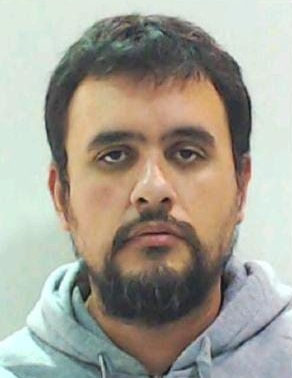

Bienvenidos a
# Presentación personal

Acá vas a encontrar un poco de detalle de mi experiencia profesional y mi formación.

## Formación
:student: Técnico electrónico, de la vieja técnica, egresado en 2001.
:man_student: Estudiante de ingeniería electrónica frustrado.
:books: Tengo sólido formación en el campo de la metrología y cálculo de incertidumbres.
:keyboard: AMATEUR en el ámbito de la programación, con algo de conocimiento en VBA que utilizo en Excel para automatizar planillas laborales.
:keyboard: SUPER AMATEUR en el ámbito de la programación en ARDUINO, con algunos pequeños proyectos relacionados a la medición de temperatura, humedad y registro de las mismas.

## Experiencia profesional
- [x] :man_scientist: [CES SA](www.ces-sa.com.ar) Desarrollando mis primeros pasos en metrologia hasta quedar a cargo del area encargada del area metrologica. 
- [x] :atom_symbol: [Comisión Nacional de Energía Atómica - LCIM](https://www.argentina.gob.ar/cnea) Mi trabajo actual. Supervisor técnico del Laboratorio LCIM, que realiza calibraciones para toda CNEA.
- [x] :heavy_check_mark: [Organismo Argentino de Acreditación](https://oaa.org.ar/) Desarrollo tareas como Experto Técnico en la especialidad de productos eléctricos, eficiencia energética y encendedores,
y como Evaluador Técnico en Laboratorios de Calibración en la especialidad de dimensional, masa, temperatura, electricidad.

